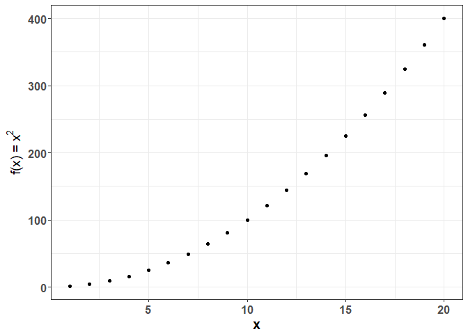
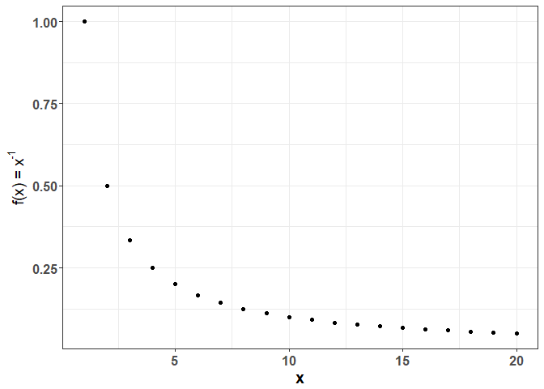
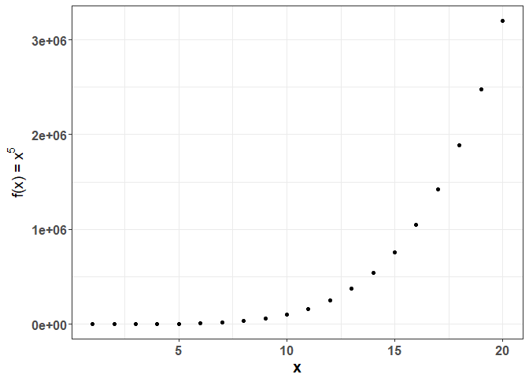

Powers
======

This folder contains an R package called "powers". The functions in this package are a convenient way of taking numbers to various powers, and plotting the result. The functions are also capable of taking strings to arbitrary "powers" which just means to repeat them in this context. The functions themselves can be found in the "R" folder. See the inst/doc folder for a useful vignette that explains some example usage for this package. Below is a list of all external functions:

-   pwr: This function takes inputs to an arbitrary power

-   reciprocal: This function takes inputs to the -1 power.

-   cube: This function takes inputs to the 3rd power.

-   square: This function takes inputs to the 2nd power.

The package also contains two variables: `tenvec` and `negtenvec`. These are vectors of numbers from 1 to 10 or -1 to -10, useful for testing.

Installation
------------

You can install powers from github with:

    install_github("HScheiber/powers")

Examples
--------

This is a basic example which shows you how to solve a common problem, squaring a number:

``` r
powers::square(1:10)
#>  [1]   1   4   9  16  25  36  49  64  81 100
```

We can plot a function using the input switches:

``` r
plot_object <- powers::square(1:20, plot_it = TRUE, returnVal = FALSE, returnPlot = TRUE)
```



It is even possible to use these functions on character data:

``` r
powers::cube(letters)
#>  [1] "a a a" "b b b" "c c c" "d d d" "e e e" "f f f" "g g g" "h h h"
#>  [9] "i i i" "j j j" "k k k" "l l l" "m m m" "n n n" "o o o" "p p p"
#> [17] "q q q" "r r r" "s s s" "t t t" "u u u" "v v v" "w w w" "x x x"
#> [25] "y y y" "z z z"
```

The `reciprocal` function takes the -1 power of numerics, and reverses the direction of characters:

``` r
powers::reciprocal(1:20, plot_it = TRUE)
```



    #>  [1] 1.00000000 0.50000000 0.33333333 0.25000000 0.20000000 0.16666667
    #>  [7] 0.14285714 0.12500000 0.11111111 0.10000000 0.09090909 0.08333333
    #> [13] 0.07692308 0.07142857 0.06666667 0.06250000 0.05882353 0.05555556
    #> [19] 0.05263158 0.05000000

    powers::reciprocal("Hello world")
    #> [1] "dlrow olleH"

If the user feels the need to take any arbitrary power and plot the result, that is also possible in this package using the `a` input of the `pwr` function:

``` r
powers::pwr(1:20, a = 5, plot_it = TRUE)
```



    #>  [1]       1      32     243    1024    3125    7776   16807   32768
    #>  [9]   59049  100000  161051  248832  371293  537824  759375 1048576
    #> [17] 1419857 1889568 2476099 3200000

    powers::pwr("Hello world", a = -2)
    #> [1] "dlrow olleH dlrow olleH"

For developers
--------------

The pow.R function is an internal function that all external functions in this package depend on. It takes an input number or vector to an arbitrary power. Please build any new functions for this package by utilizing the `pow.R` function.
